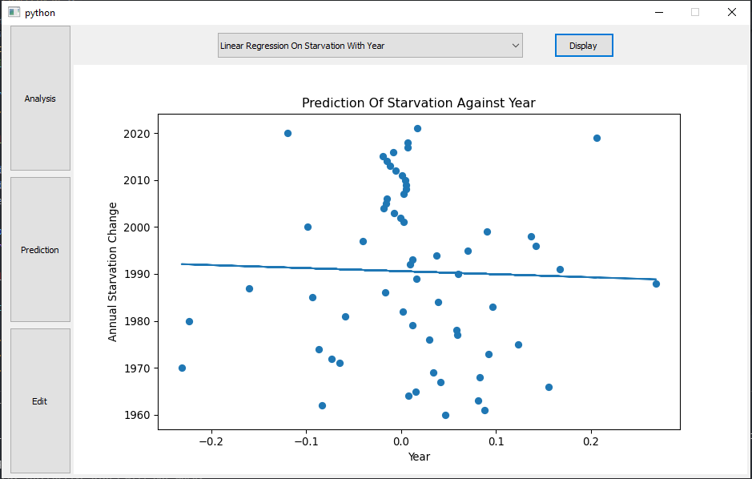

# Starvation-Period-Analysis-And-Forecast
A desktop application that performs analysis and predicts starvation rates in Pakistan using numerous distribution techniques, regression models, forcasting models etc

## Features

- [x] Simple UI using PYQT5.
- [x] Different charts such as histogram, line graph etc to point the trends of data.
- [x] Facebooks Prophet for Trend Prediction.
- [x] Distribution models such as binomial, pisson for different data generation.
- [x] Regression models such as linear, polynomial, and multiple regression to predict the accuracy of relationships between different factors.
